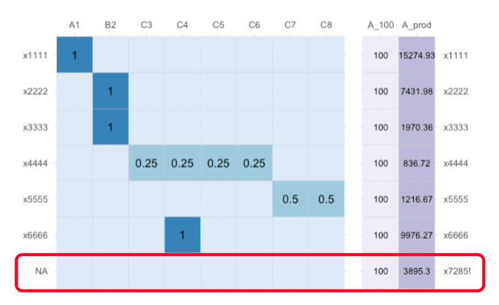
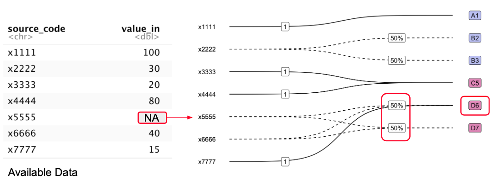

## Nomenclature Variables and Datasets

### Merging Data with related but distinct semantics

Merging datasets is a common part of data wrangling. The easiest kind of integration involves merging semantically identical data from multiple sources or tables. This somewhat trivial type of integration can be achieved simply by concatenating records. Slightly less trivial, but still relatively straightforward is merging datasets with semantically identical variables stored under different column names. Schema crosswalks, also known as Metadata crosswalks, are often used to encode and share the necessary schema transformations, such as renaming variables or matching metadata fields. Next, data with the same underlying semantics but differences in structure (physical layout) must be reshaped before integration. Tidy data principles @wickham2014 provide a standard way of tidying such data so that then can be concatenated together. However, relatively little work has been done on improving methods for wrangling data which have related but distinct semantics.

Data with related but distinct semantics most often arise when nomenclature are updated to reflect changing in some underlying phenomena of interest. For instance, the semantics of labour force occupation statistics will change when the nomenclature for classifying labour force participants into occupations is updated to reflect real world changes in the kinds of jobs available in the economy. Data collected before and after a occupation nomenclature update are clearly related but have distinct semantics.

**quote from @ehling2003**

> Harmonisation creates a desired degree of comparability...

**Ex-post harmonisation exists in many areas of social science: labour econ, household and consumer surveys, trade econ**

### Nomenclature Variables

Let us define a **nomenclature variable** as a collection of values indexed by a set of names, where the names correspond to categories or classes in a particular nomenclature, and the values are measured on those particular categories or classes. Multiple nomenclature variables can share the same name index. Now, define a **nomenclature transformation** as the transformation of variables from one nomenclature to another. Such transformations must involve the renaming or recoding of the name index, and may also modify the indexed values depending on the mapping between nomenclatures. The most common type of modification is aggregation of numeric values, which occurs when the nomenclature transformation collapses multiple nodes of the source nomenclature into a single node in the target nomenclature.

Hence, **ex-post harmonisation** can be understood as the nomenclature transformation and merging of multiple nomenclature variables which contain semantically related values and are indexed by distinct but related nomenclatures. Moreover, transformations which modify measured numeric values should only be applied to nomenclature variables where the values form an aggregate pool. In practice this means the indexed values should be counts, since applying a nomenclature transformation effectively pools these semantically related values and redistributes them into a common nomenclature. From here one, we refere to such variables as **nomenclature count variables**.

### Tidy Nomenclature datasets

@wickham2007 introduces a division of dataset variables into two types: **identifier and measured variables:**

-   Identifier variables identify the unit that measurements are taken on.
-   Measured variables are values measured on the observation unit defined by the identifier variables.

Using the additional abstraction step of splitting measured variables into id-value pairs, we extend this taxonomy slightly to define a "tidy nomeclature data" format:

-   **Observational Unit Identifier Variables** are any identify variables used to index observational units. For example, country and year variables could be used to index population observations.
-   **Nomenclature Index (Identifier) Variables** identify the dimension, or set of dimensions, for the observation unit which measurements take place on.
-   **Measured Variables** contain values measured on the observation unit and dimension. The dimension id and measured variables form name-value pairs on a particular dimension of the observational unit.

@wickham2014's **tidy data** (see [`vignette("tidy-data", package = "tidyr")`](https://tidyr.tidyverse.org/articles/tidy-data.html#defining)) format describes a standard way of structuring tabular datasets using the following data semantics:

> A dataset is a collection of **values**, usually either numbers (if quantitative) or strings (if qualitative). Values are organised in two ways. Every value belongs to a **variable** and an **observation**.

Under these semantics, every value in a tidy dataset belongs either to a observational unit identifier variable or a "simple" dimension variable. However, **nomenclature variables** are name-value pairs split across two columns, one for the nomenclature "dimension" identifier variable, and one for the associated measured value. Furthermore, under a semantic role system [@kandel2011], the nomenclature name column has the semantic role of "classification code", while the value column would have a standard data type (e.g. integer). Hence, a nomenclature variable can also be thought of as pairings of classification code and value columns.

A **nomenclature dataset** consists of multiple observations of a single nomenclature variable. In a tidy nomenclature dataset, each observational unit should have the same number of rows across a shared nomenclature.

Hence for **tidy nomenclature data**:

1.  Every column is either a identifier variable, or a measured value
2.  Every row is an observation on a nomenclature sub-dimension
3.  Every cell is a single value of an identifier variable, nomenclature index label, or measured variable.

Moreover, since observational unit variables and dimensions

<!--- insert example table here --->

If we nest nomenclature data, we obtain a structure analogous to the standard tidy data format (@wickham2014):

1.  Every column is a variable
2.  Every row is an observation
3.  Every cell is single value *or nested name-value set*.

### Example Nomenclature Dataset

To illustrate, consider data on population by state in Australia[^1] shown below.

[^1]: Source: [Australian Bureau of Statistics](https://www.abs.gov.au/statistics/people/population/national-state-and-territory-population/jun-2022)

```{r echo=FALSE}
state_data <- tibble::tribble(
                              ~State,    ~`Population (est. 30 Jun 2022)`,
                   "New South Wales", 8153600,
                          "Victoria", 6613700,
                        "Queensland", 5322100,
                   "South Australia", 1820500,
                 "Western Australia", 2785300,
                          "Tasmania",  571500,
                "Northern Territory",  250600,
      "Australian Capital Territory",  456700
)

total_pop_ex <- round(sum(state_data$`Population (est. 30 Jun 2022)`) / 10^6, 2)
```

```{r echo=FALSE}
knitr::kable(state_data, caption = "Australian population by State (excl. Other Territories)")
```

The set of all name-value pairs of state/territory name and population estimate for a given time period form a nomenclature variable observation for Australia. Furthermore, since the values form an aggregate pool for the total population of Australia, we can consider this to be a **nomenclature count variable**.

Notice that nomenclature datasets blur the distinction between variable and value. For example, we could describe the above table as containing values of a `population` variable attached to the observational units of `state`, rather than a single observation of a `state-population` nomenclature variable (dimension-value pair) for the observational unit of "Australia".

However, the concept of a dimension identifier variable is useful for defining the data structure required to use crossmaps. Just as wider dataset formats are useful for data entry, and longer formats are more suited for analysis, the two-column nomenclature variable format is ideal for transforming or harmonising data between nomenclature.

The format is particularly suitable for cases where the original nomenclature:

a.  has sufficiently many category nodes that a wider format is difficult to work with,
b.  and/or will be transformed using a crossmap
c.  is expected to change relatively frequently (e.g. occupation or product classifications)
d.  is one layer of a larger hierarchical nomenclature (e.g. administrative regions or geographic areas)

<!--- wide format vs. nomenclature format // makes sense in the context of transformation // nomenclature is sort of an observation id variable, except its not fixed the same way an observation id variable is --->

<!---- show examples --->

## Nomenclature Transformations

### Crossmaps as Transformation Matrices

The utility of defining a nomenclature variable and the crossmap format is most evident when we look at the transformation of values from a source nomenclature into a target nomenclature as a set of matrix operations. To demonstrate, we use the `xmap::xmap_to_matrix()` function to take a valid crossmap (`abc_xmap`) and convert it into a incidence matrix (`b_mtx`):

```{r}
library(xmap)
## define crossmap
abc_xmap <- tibble::tribble(
      ~origin, ~dest, ~link,
          "a",  "AA",     1,
          "b",  "AA",     1,
          "c",  "AA",     1,
          "d",  "BB",     1,
          "e",  "CC",     1,
          "f",  "DD",   0.3,
          "f",  "EE",   0.3,
          "f",  "FF",   0.4
      ) |>
  as_xmap_df(from = origin, to = dest, link)

## convert to matrix
b_mtx <- xmap_to_matrix(abc_xmap, sparse = FALSE)
b_mtx
```

<!--- it would be cool to colour the matrix by relation type --->

Let $\bf{B}$ be the $n \times m$ incidence matrix describing the graph representation of a valid crossmap. $\bf{B}$ is row indexed by the source nomenclature, and column indexed by the target nomenclature.

The two conditions for a valid crossmap can be expressed as properties of the incidence matrix $\bf{B}$:

1.  Each node in the source or target set indexes *one* row or column respectively, providing at most one non-zero link between nodes in the source and target nomenclature.
2.  Each row contains the weights for all outgoing links from a given source node. Thus, each row of the matrix should sum to 1 (i.e. $\bf{B1} = \bf{1}$ where $\bf{1}$ is unit vector of length $n$).

Now, let $\bf{x}$ be a vector of length $n$ containing numeric values to be transformed. If $\bf{x}$ is also row-indexed by the source nomenclature node, then the index-value pair forms a nomenclature variable. Assume the values are count variables such that $\bf{x}$ is a nomenclature pool variable.

To redistribute $\bf{x}$ from the source nomenclature into the target nomenclature, we simply take $\bf{y} = \bf{B}'\bf{x}$. Hence, using a valid crossmap to transform a nomenclature variable is equivalent to a matrix transformation of $\bf{x}$ by the incidence matrix $\bf{B}$.

```{r}
## define example data
x <- matrix(rep_len(100, nrow(b_mtx)))
dimnames(x) <- list(row.names(b_mtx), "x")

## apply transformation
y <- t(b_mtx) %*% x

## print
matlib::printMatEqn(`B'` = t(b_mtx), x, "=", y)
```

Given this equivalence, it is clear to see how the two conditions that define a crossmap guarantee that the total sum before and after the nomenclature transform remains the same. Moreover, we can be sure of this without checking the total of the resultant variable $\bf{y}$.

### Comparison to Existing Approaches

Using crossmaps for recoding, aggregation or disaggregation can seem a bit tedious given you can achieve the same transformation with some simple join and mutate statements, coupled with some ad-hoc validation. However, crossmaps provide assurance for transformations with multiple mapping relations being applied at once that is not possible with ad-hoc validation. In particular, it circumvent the need to count the number of observations after merging, and hence can insure against duplication and erroneous drops even in cases where it is difficult to calculate the expected number of post-transformations rows (i.e. many-to-many relations with both split and collapse transformations).

#### Iterative or Case-Wise Transformation

To further illustrate the advantages of the crossmap approach, consider iterative or case-wise approach whereby data are transformed on a node by node basis. Regardless of whether you code the transformation as a distribution of value from the source nomenclature nodes or collection of value by the target nomenclature nodes, there are only ad-hoc ways of validating node-by-node transformations.

For instance, one could calculate and compare the sums of $\bf{x}$ and $\bf{y}$. However, even if these two totals are equal, this does not guarantee that each source value is fully redistributed into the target nomenclature, as it is possible, though highly unlikely, that two mistakes could offset each other. Furthermore, in the case where the two totals do not match, it is not obvious how to identify which nodes are involved in the mistake. This second issue scales with the size of the nomenclature as the number of lines of code required to execute the transformation increases.

<!--- counting rows? ---->

Consider the following imperative code for transforming $\bf{x}$ into the target nomenclature:

```{r, attr.source='.numberLines'}
y <- list()

y$AA = x["a", ] + x["b", ] + x["c", ]
y$BB = x["d", ]
y$CC = x["c", ]
y$DD = 0.3 * x["f", ]
y$EE = 0.2 * x["f", ]
y$FF = 0.4 * x["f", ]

y |> as.matrix()
```

Observe the following:

-   The value attached to source node `c` is mistakenly distributed twice (lines 3 and 4) into the transformed vector $\bf{y}$, whilst the source value for `e` has not been distributed at all.
-   The source node `f` in the `origin` source nomenclature is split by three outgoing links to `DD`, `EE` and `FF`. Notice that we would need to check three lines of code (6-8) to validate that the weights sum to one. In fact, the weights above only sum to `0.9`.
-   The total sum of $\bf{x}$ is `600`, and does not match the total sum of $\bf{y}$ which is `590`. However, this mismatch can be fixed by detecting and correcting the second weights error alone, and provides no insight on the first double distribution error.

<!---- reference validate, assertr packages? --->

#### Crosswalk and Lookup Table approaches

> -   Crosswalk or lookup table approaches are better than above
> -   but are still limited when it comes to dealing with split relations and complex xmaps
> -   unambiguous matches are left to the user, not supported

<!---- existing packages // forcats, recode etc. --->

### Additional Benefits

#### Code-Agnostic Dataset Design

In addition to circumventing the need for ad-hoc checks, the crossmap format provides a code-agnostic method of specifying, communicating and checking dataset design decisions. This means that team members who are not fluent in R can have confidence that harmonised or integrated datasets match the intended design without having to audit long data wrangling scripts. This is particularly important in cross-disciplinary teams, where domain knowledge is necessary for designing link weights.

As more and more datasets are created by integrating data from multiple sources, principled methods for recording, validating and sharing design choices such as ex-post harmonisation, or disaggregation and re-aggregation schemes can facilitate trust and transparency.

> -   maybe add-in `vignette("vis-xmaps")` content here?

#### Multiple related nomenclature transformations (FUTURE WORK)

Returning to the tidy nomenclature format, note that each nested name-value set is analogous to $\bf{x}$, where the name column indexes the measured values.

> -   kronecker product for multiple observation vectors in the same source nomenclature to same target nomenclature
> -   list/nested approach for multiple observation vectors in different source noemncalture but same target nomenclature
> -   resolving discrepancies between aggregation levels

<!--- treat each nested name-value set as a named column vector // and crossmaps as a transformation matrix. Overly complicated for a single crossmap, but useful for different crossmaps -->

## Apply `xmap` to data using Mutating Joins

All crossmaps transformations can be decomposed into multiple "standard" data manipulation steps:

1.  **Rename source node labels into target nomenclature.** This can be achieved via a left-join between source data and the crossmap by the source node labels.

2.  **Mutate source node values by link weight.** This can be achieved by multiplying the source value with the joined link weights.

3.  **Summarise mutated values by target node.** This can be achieved by grouping and summarising the mutated values from step 2 by the joined target node labels.

### Transformation effects by relation type

The combined effect of these steps differs depending on the type of relation present in a given crossmap. For all types of relations, step 1 is a data modifying step since it attaches target nodes and links to the original data via the source node labels.

For recoding relations, step 1 is the only data modifying step. Step 1 effectively "renames" the source nodes into the target nomenclature. For the remaining steps, multiplying the source values by unit weights leaves the values unchanged, and since recoding involves only one-to-one relations summarising by target node also leaves values unchanged. The number of rows in the original data and the transformed data remain the same.

For collapsing relations, step 3 is the additional data modifying steps. Similar to recoding, the source values are multiplied by unit weights, leaving them unchanged. Then in step 3, the unmodified source values are "modified" via aggregation, which reduces the number of rows in the data relative to the original data.

For split relations, step 1 and 2 are data modifying. Step 1 expands the row count compared to the original data, as at least one row will have a source label associated with multiple target nodes. The source values are "duplicated" row-wise to each source-target link. Then in step 2, source values are modified according to the fractional link weights. Step 2 effectively "distributes" value between the linked target nodes. In step 3, no further modification is performed since, by definition, split relations do not contain any many-to-one links. The number of row remains the same as after step 1, with more rows relative to the original data.

Finally, for many-to-many relations, which are a combination of the above relation types, all three steps are data modifying. Similar to collapsing relations, step 3 modifies via aggregation. However, prior to aggregation, some source values will be duplicated and modified by fractional link weights as in split relations. The overall effect on the number of rows depends on how many rows the collapse relations aggregates relative to how many rows the split relations create.

### `xmap` Usage Conditions

<!--- practical considerations --->

#### Structure of Original Dataset

> Does this depend on the kind of transformation? what is the requirement from `{conformr}` to check validity

#### Recoding Categorical Variables

> -   getting categorical variables into nomenclature variable format is a bit tedious and unnecessary,
> -   but is it useful to show the equivalence?
> -   one-hot encoded categorical variables = nomenclature format

```{r}
baby_pets <- c("puppy", "kitten", "chick")
adult_pets <- c("dog", "cat", "bird")

pet_xmap <- tibble::tibble(baby = baby_pets,
                           adult = adult_pets,
                           link = 1)

## some data on pets
pet_df <- tibble::tibble(obs_id = 1:5, pet_type = sample(baby_pets, 5, replace = TRUE), bool = 1)

## categorical variable format
pet_df

## the format needed to use apply_xmap()
pet_df |> tidyr::pivot_wider(names_from = "pet_type", values_from = "bool") |>
  tidyr::pivot_longer(cols=dplyr::all_of(baby_pets)) |>
  tidyr::replace_na(list(value = 0))
```

#### Dataset Coverage Requirement

The source nodes in the crossmap must fully cover the nomenclature of the data to be transformed. This is equivalent to saying that the crossmap should contain transformation instructions for every single piece of data in the original dataset. In the figure below, the name-value pair for the category `x7285!` in the source data (shown in purple) does not have an associated set of relations in the proposed transformation crossmap (shown in blue).

{width="100%"}Depending on how the transformation is implemented, coverage mismatches can result in both explicit and implicit/hidden errors. In particular, having conformable matrix dimensions is not sufficient to avoid corrupting data unless you check that the indices match.

#### Only split or collapse nomenclature pool variables

Crossmaps with split or collapse relations should only be applied to nomenclature pool variables where the measured values are counts which are part of the same aggregate pool. For example, a crossmap could be used to aggregate or further disaggregate the occupation counts shown below:

```{r}
## table 5: https://www.abs.gov.au/statistics/labour/jobs/jobs-australia/2015-16-2019-20
tibble::tribble(
                                  ~Occupation, ~`Male.('000.persons)`, ~`Female.('000.persons)`,
                                   "Managers",                  934.4,                    668.5,
                              "Professionals",                 1190.9,                   1542.2,
             "Technicians and trades workers",                 1229.7,                      225,
     "Community and personal service workers",                    443,                    998.1,
        "Clerical and administrative workers",                  373.5,                   1203.7,
                              "Sales workers",                  382.6,                    651.4,
            "Machinery operators and drivers",                  621.3,                     81.3,
                                  "Labourers",                  815.5,                      437
     ) |> knitr::kable()
```

On the other hand, non-count numeric variables such as averages should not be aggregated or disaggregated. In this case, it only makes sense to use recoding crossmaps, since they are effectively crosswalks or lookup tables that leave the measured values unmodified. For example, beyond recoding the industry labels, any other nomenclature transformation of the average weekly total cash earnings shown below requires knowledge of employee counts.

```{r}
## Table: All employees, average weekly total cash earnings - industry
## https://www.abs.gov.au/statistics/labour/earnings-and-working-conditions/employee-earnings-and-hours-australia/may-2021
tibble::tribble(
                                              ~industry,  ~avg_weekly_earnings,
                                               "Mining", "2,798.40",
                                        "Manufacturing", "1,457.40",
           "Electricity, gas, water and waste services", "2,060.90",
                                         "Construction", "1,600.40",
                                      "Wholesale trade", "1,468.20",
                                         "Retail trade",   "864.50",
                      "Accommodation and food services",   "664.70",
                    "Transport, postal and warehousing", "1,587.70",
             "Information media and telecommunications", "1,797.40",
                       "Finance and insurance services", "1,990.40",
              "Rental, hiring and real estate services", "1,381.70",
      "Professional, scientific and technical services", "1,911.30",
                  "Administrative and support services", "1,234.50",
                     "Public administration and safety", "1,745.40",
                               "Education and training", "1,374.80",
                    "Health care and social assistance", "1,287.40",
                         "Arts and recreation services", "1,032.90",
                                       "Other services", "1,043.10",
                                       "**All industries**", "**1,394.10**"
) |> knitr::kable()
```

#### Handle missing values before crossmap transformation

Missing values should be dealt with prior to transformation as they can silently corrupt data in collapse or split transformations. The figure below shows a nomenclature variable with a missing value which cannot be unambiguously resolved in the crossmap transformation. The missing value belongs to a source node which is part of both a split and collapse relations.

{width="100%"}

Naive application of the crossmap transformation implicitly attempts to apply arithmetic operations on missing values. However, missing values are not numbers, and as such, it does not make sense to split an `NA` in half as illustrated in the outgoing links from the `x5555` node. Similarly, the target node `D6` receives both `NA` and numeric values from multiple source nodes and cannot be combined without additional preprocessing decisions. Handling missing values prior to applying the crossmap explicitly records such decisions.

For instance, in R, the function `sum()` takes the argument `na.rm` which when `TRUE` removes missing values from the sum. This is equivalent to treating missing values as `0` when collapsing multiple source values into a target node, and hence should be handled explicitly before applying the crossmap transformation.

Exactly how missing values should be treated will vary from dataset to dataset. This could involve replace the missing values with zeroes or some imputed values, or to remove them completely. Lastly, note that crossmaps with only one-to-one recode relations avoids this "**missing value arithmetic**" issue since missing values can be passed unmodified in to the target nomenclature. Nevertheless, it is still advisable to handle missing values prior to applying the crossmap so that missing value decisions and nomenclature transformations are encoded in separate steps.

#### Avoid multiple observations for each source node

In addition to the tidy structure requirement described above, for each observational unit in the dataset, which can span multiple rows, there should ideally only be one name-value pair for each unique node in the original nomenclature. This ensures that only one numeric value is transformed for each source-target link.

This is not a strict requirement when applying crossmap transformations with mutating joins, but avoids hidden aggregation across source nodes. Returning to the matrix representation, this requirement is equivalent to having a uniquely indexed source value vector.

<!--- also ensures the source values can be converted into an indexed vector -->

```{r}
origin_tidy_sub <- tibble::tribble(
  ~country, ~year, ~sector, ~subsector, ~output,
  "AU", 2012, "AGR", "FISH", 3983,
  "AU", 2012, "AGR", "LIVE", 432,
  "AU", 2013, "AGR", "FISH", 3983,
  "AU", 2013, "AGR", "LIVE", NA,
)

origin_tidy_sub
```

The above dataset is tidy for a crossmap with `subsector` source nodes, but would not be considered tidy for a crossmap with `sector` source nodes. To solve this, we simply aggregate up to the `sector` level, and obtain a set unique set of name-value pairs for the `sector` level nomenclature variable.

```{r}
origin_tidy_sec <- origin_tidy_sub |>
  dplyr::group_by(country, year, sector) |>
  dplyr::summarise(output = sum(output, na.rm = TRUE), .groups = "drop")

origin_tidy_sec
```

## Example `xmap` Transformations

> what examples do I want to include?

### `xmap` Aggregation

Let's consider a simple case where we have some disaggregated population figures which we want to aggregate.

First, define a crossmap for the aggregation.

```{r}
library(xmap)

agg_map <- data.frame(ctr = "AU",
                      adm1 = c("AU-NSW", "AU-QLD", "AU-SA", "AU-TAS", "AU-VIC", "AU-WA", "AU-ACT", "AU-NT"),
                      link = 1) |>
  as_xmap_df(adm1, ctr, link)
```

Second, load in our state-level figures

```{r}
state_data <- tibble::tribble(
                              ~state,    ~adm1,    ~Pop,
                   "New South Wales", "AU-NSW", 8153600,
                          "Victoria", "AU-VIC", 6613700,
                        "Queensland", "AU-QLD", 5322100,
                   "South Australia",  "AU-SA", 1820500,
                 "Western Australia",  "AU-WA", 2785300,
                          "Tasmania", "AU-TAS",  571500,
                "Northern Territory",  "AU-NT",  250600,
      "Australian Capital Territory", "AU-ACT",  456700
)
```

Now, assuming your crossmap fully covers your data the transformation:

1.  Join the aggregate groups (`state`) to each row in `state_data` via the source labels (`adm1`)
2.  Mutate the source values (`Pop`)
3.  Summarising values for each group (`state`)

> would this be a good place to put a small-set illustration?

```{r}
dplyr::left_join(state_data, agg_map, by = c("adm1")) |>
  dplyr::mutate(x_pop = Pop * link) |>
  dplyr::group_by(ctr) |>
  dplyr::summarise(agg_pop = sum(x_pop))
```

Or using `apply_xmap()` from the `conformr` package:

``` r
conformr::apply_xmap(data_in = state_data, xmap = agg_map,
                     in_codes = adm1, in_values = Pop,
                     out_codes = NULL, out_values = NULL)
```

which also checks that the nomenclature in `data_in` is fully covered by your `xmap` -- i.e. you don't lose any source values during the step 1 join.

### `xmap` Disaggregation

We can reverse the aggregation (assuming we retained appropriate weights) using:

``` r
apply_xmap(data_in = ctr_data, xmap = disagg_map, in_codes = ctr, in_values = Pop, out_codes = NULL, out_values = NULL)
```

> add simple example

### Wild Caught (Hierarchical) Nomenclature Data

Let's tidy a wild caught dataset:

``` r
aus_pop <- "data-raw/abs-population_2022.xlsx"
aus_pop <- readabs::download_abs_data_cube("national-state-and-territory-population", "31010do001_202206.xlsx")
```

``` r
raw_abs_pop <- readxl::read_xlsx(aus_pop,
                               sheet = "Table_3", range = "A6:D23")
```

```{r}
raw_abs_pop <-     tibble::tribble(
                                       ~...1,     ~X2002,     ~X2012,     ~X2022,
                                          NA,      "no.",      "no.",      "no.",
                 "Australia–at 30 September",         NA,         NA,         NA,
                           "New South Wales",  "6580807",  "7304244",  "8153584",
                                  "Victoria",  "4817774",  "5651091",  "6613727",
                                "Queensland",  "3653123",  "4568687",  "5322058",
                           "South Australia",  "1511567",  "1656725",  "1820530",
                         "Western Australia",  "1928512",  "2425507",  "2785312",
                                  "Tasmania",   "474152",   "511724",   "571517",
                        "Northern Territory",   "202251",   "235915",   "250635",
              "Australian Capital Territory",   "324627",   "376539",   "456652",
                         "Other Territories",         NA,         NA,         NA,
                      "Jervis Bay Territory",      "464",      "380",      "312",
             "Territory of Christmas Island",     "1365",     "2107",     "1781",
      "Territory of Cocos (Keeling) Islands",      "568",      "546",      "614",
                            "Norfolk Island",        "0",        "0",     "2213",
                   "Total Other Territories",     "2397",     "3033",     "4920",
                           "Total Australia", "19495210", "22733465", "25978935"
      )
```

Let's start by doing some standard data import tidying: removing the first two rows of table notes and giving the first column a sensible name.

```{r}
abs_pop <- raw_abs_pop |>
  dplyr::slice(3:dplyr::n()) |>
  dplyr::rename(area = `...1`)

knitr::kable(abs_pop)
```

The above table is unfortunately not in tidy nomenclature format.

#### Issue 1: Multiple Nomenclature Variables in the Same Table

First, the table contains values at multiple hierarchical levels. In particular, it has aggregate values at both the country level (Australia), and sub-group level (Other Territories). Assume that the most disaggregated values are the nomenclature variable we are interested in.

Now, split the table to remove totals and the "Other Territories" divider row:

```{r}
abs_split <- split(abs_pop, stringr::str_detect(abs_pop$area, "Total|Other Territories", negate = TRUE))
state_pop <- abs_split$`TRUE`

knitr::kable(state_pop)
```

#### Issue 2: Observation Units split across columns

Further notice that the observational unit that we would want to apply the aggregation transformation on is year. Hence, we pivot the dataset longer:

```{r}
state_nom <- state_pop |>
  tidyr::pivot_longer(cols = -area, names_to = "year", values_to = "population") |>
  dplyr::select(year, dplyr::everything()) |>
  dplyr::arrange(year)

knitr::kable(state_nom)
```

## References
