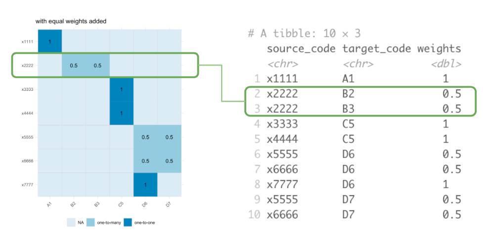

## Alternative representations of Crossmaps

Crossmaps aim to encode dataset integration and harmonisation choices separately to the code used to apply those such designs to data. It follows that visualisations and plots of the candidate crossmaps could be useful during the design process. For instance, Sankey diagrams are sometimes used to visualise schema crosswalks.

This article provides a few ggplot2 code examples for visualising crossmaps. The package will offer functions for generating these visualisations from `xmap` objects in future releases.

```{r message=FALSE}
library(ggplot2)
library(dplyr)
library(stringr)
library(patchwork)
library(ggbump)
library(xmap)
```

### Table

Let's start with visualising a section of the ANZSCO22 to ISCO8 crosswalk published by the Australian Bureau of Statistics:

```{r}
anzsco_cw <- tibble::tribble(
      ~anzsco22,                        ~anzsco22_descr, ~isco8, ~partial,                                         ~isco8_descr,
       "111111", "Chief Executive or Managing Director", "1112",      "p",                        "Senior government officials",
       "111111", "Chief Executive or Managing Director", "1114",      "p", "Senior officials of special-interest organizations",
       "111111", "Chief Executive or Managing Director", "1120",      "p",            "Managing directors and chief executives",
       "111211",            "Corporate General Manager", "1112",      "p",                        "Senior government officials",
       "111211",            "Corporate General Manager", "1114",      "p", "Senior officials of special-interest organizations",
       "111211",            "Corporate General Manager", "1120",      "p",            "Managing directors and chief executives",
       "111212",         "Defence Force Senior Officer", "0110",      "p",                 "Commissioned armed forces officers",
       "111311",          "Local Government Legislator", "1111",      "p",                                        "Legislators",
       "111312",                 "Member of Parliament", "1111",      "p",                                        "Legislators",
       "111399",                      "Legislators nec", "1111",      "p",                                        "Legislators"
      )

links <- anzsco_cw |>
  dplyr::group_by(anzsco22) |>
  dplyr::summarise(n_dest = dplyr::n_distinct(isco8)) |>
  dplyr::ungroup() |>
  dplyr::transmute(anzsco22, weight = 1/n_dest) |>
  dplyr::left_join(anzsco_cw, by = "anzsco22")

## get code tables
table_anzsco <- anzsco_cw |>
  dplyr::distinct(anzsco22, anzsco22_descr)
table_isco8 <- anzsco_cw |>
  dplyr::distinct(isco8, isco8_descr)

## make xmap
anzsco_xmap <- links |>
  as_xmap_df(anzsco22, isco8, weight)
```

The included `print()` method for `xmap_df` objects:

```{r}
print(anzsco_xmap)
```

### Bigraph

Visualisation as a bigraph is particularly useful for seeing the relations between the two nomenclature.

```{r message=FALSE}
.bigraph_add_link_style <- function(edges, x_attrs, ...) {
  ## generate out link type
  style_out_case <- tibble::tribble(
    ~out_case, ~line_type, ~font_type,
    "unit_out", "solid", "bold",
    "frac_out", "dashed", "italic")
  edges |>
    dplyr::mutate(out_case = dplyr::case_when(.data[[x_attrs$col_weights]] == 1 ~ "unit_out",
                                              .data[[x_attrs$col_weights]] < 1 ~ "frac_out")) |>
    dplyr::left_join(style_out_case,
              by = "out_case") |>
    dplyr::ungroup()
}

.bigraph_add_node_positions <- function(edges, x_attrs, pos_from, pos_to, ...) {
  ## attach node positions
  edges |>
    dplyr::left_join(pos_from, by = setNames("from_set", x_attrs$col_from)) |>
    dplyr::left_join(pos_to, by = setNames("to_set", x_attrs$col_to)) |>
    dplyr::mutate(from_x = 0,
                  to_x = 5) |>
    dplyr::mutate(idx = dplyr::row_number())
}

plt_xmap_bigraph <- function(x, ...) {
  stopifnot(is_xmap_df(x))
  x_attrs <- attributes(x)
  edges_short <- tibble::as_tibble(x)
  
  df_out_style <- .bigraph_add_link_style(edges_short, x_attrs)
  
  ## generate node positions
  from_nodes <- tibble::tibble(from_set = x_attrs$from_set) |>
    dplyr::mutate(from_y = dplyr::row_number())
  to_nodes <- tibble::tibble(to_set = unique(x[[x_attrs$col_to]])) |>
    dplyr::mutate(to_y = dplyr::row_number() - 1 + 0.5)
  
  df_gg <- .bigraph_add_node_positions(df_out_style, x_attrs,
                                       from_nodes, to_nodes)
  ## build ggplot
  ggplot2::ggplot(data = df_gg,
                  aes(x = from_x, xend = to_x,
                      y = from_y, yend = to_y,
                      group = idx)) +
    ## edges
    ggbump::geom_sigmoid(aes(linetype = I(line_type))) +
    ggplot2::geom_label(data = dplyr::filter(df_gg, out_case == "unit_out"),
             aes(x = (from_x + to_x) / 4,
                 y = from_y,
                 label = round(.data[[x_attrs$col_weights]], 2))) +
    ggplot2::geom_label(data = dplyr::filter(df_gg, out_case == "frac_out"),
             aes(x = (((from_x + to_x) / 2) + to_x) / 2,
                 y = to_y,
                 label = round(.data[[x_attrs$col_weights]], 2))) +
    ## from nodes
    ggplot2::geom_text(aes(x = from_x - 0.5, y = from_y,
                           label = .data[[x_attrs$col_from]],
                           fontface=I(font_type)),
                      ## drop idx groups to avoid duplicate labels
                      stat = "unique", inherit.aes = FALSE) +
    ## to nodes
    ggplot2::geom_label(aes(x = to_x + 0.5, y = to_y, 
                            label = .data[[x_attrs$col_to]]),
                        fill = "black",
                        alpha = 0.1) +
    ggplot2::scale_y_reverse() +
    ggplot2::theme_minimal() +
    theme(legend.position = "bottom",
        panel.grid.major = element_blank(),
        panel.grid.minor = element_blank(),
        axis.text.y = element_blank(),
        axis.text.x = element_blank(),
        plot.background = element_rect(fill = "white")) +
    labs(x = NULL, y = NULL)
}
```

```{r message=FALSE, echo=FALSE}
gg_bigraph <- anzsco_xmap |>
  plt_xmap_bigraph()
```

```{r message=FALSE, echo=FALSE, out.width="100%"}
# print bigraph and code tables
gg_bigraph
```

```{r message=FALSE, echo=FALSE}
knitr::kable(list(table_anzsco, table_isco8))
```

This visualisation also has benefits over the traditionally used Sankey diagram. Sankey diagrams are often used to illustrated "flows" between nodes. However, variable link widths can actually clutter the visualisation of crosswalks. Consider this simple crossmap that might be used to harmonise national accounts data (e.g. GDP) across two time periods.

```{r}
edges <- tribble(~ctr, ~ctr2, ~split,
                 "BLX", "BEL", 0.5,
                 "BLX", "LUX", 0.5,
                 "E.GER", "DEU", 1,
                 "W.GER", "DEU", 1)
```

{width="100%"}

On the other hand, the bigraph visualisation shows more clearly how data is modified (or not) when harmonising between nomenclature. The solid lines show when a link does not modify the source values, whilst the dotted line style indicates that data will be split up. Furthermore, by using fixed width links, there is room to place labels on-top of each curve indicated the transformation weights.

{width="100%"}

### Matrix

Another useful visualisation or representation of a crossmap is as an incidence matrix with the source nomenclature indexed along the rows and the target nomenclature indexed on the columns:

```{r xmap-as-matrix}
plt_xmap_ggmatrix <- function(x, ...){
  stopifnot(is_xmap_df(x))
  x_attrs <- attributes(x)
  edges_complete <- tibble::as_tibble(x) |> 
    tidyr::complete(.data[[x_attrs$col_from]], .data[[x_attrs$col_to]])
  
  ## add link-out type
  gg_df <- edges_complete |>
    dplyr::mutate(out_case = dplyr::case_when(.data[[x_attrs$col_weights]] == 1 ~ "one-to-one",
                                              .data[[x_attrs$col_weights]] < 1 ~ "one-to-many",
                                              is.na(.data[[x_attrs$col_weights]]) ~ "none")
                  )
  
  ## make plot
  gg_df |> ggplot(aes(x=.data[[x_attrs$col_to]],
                      y=.data[[x_attrs$col_from]])) +
    geom_tile(aes(fill=out_case), col="grey") +
    scale_y_discrete(limits=rev) +
    scale_x_discrete(position='top') +
    scale_fill_brewer() +
    coord_fixed()  +
    labs(x = x_attrs$col_to, y = x_attrs$col_from, fill="Outgoing Link Type") +
    theme_minimal() +
    geom_text(data = dplyr::filter(gg_df, !is.na(.data[[x_attrs$col_weights]])), aes(label=round(.data[[x_attrs$col_weights]], 2))) +
    theme(legend.position = "bottom",
        panel.grid.major = element_blank(),
        panel.grid.minor = element_blank()
    )
}
```

```{r}
plt_xmap_ggmatrix(anzsco_xmap)
```

Notice that the requirement that a valid crossmap has outgoing weights which sum to 1 for each source node is equivalent to a requirement that the total of weights across each row sums to 1.

{width="100%"}

## Visualising Types of Mapping Relations

```{r, echo=FALSE}
veg_1a <- c("eggplant", "capsicum", "zucchini")
veg_1b <- c("aubergine", "pepper", "courgette")
veg_2 <- c("vegetables")
fruit_1a <- c("peach", "raspberry", "kumquat")
fruit_2 <- c("fruits")
pb_1a <- c("salt", "sugar", "peanuts")
pb_2 <- c("peanut butter")
pb_1a_w <- c(0.02, 0.05, 0.93)

recode <- data.frame(au = veg_1a, uk = veg_1b, link = 1) |>
  as_xmap_df(au, uk, link)
gg_recode <- recode |> plt_xmap_bigraph()

agg <- data.frame(item = fruit_1a, group = fruit_2, link = 1) |>
  as_xmap_df(item, group, link)
gg_agg <- agg |> plt_xmap_bigraph()

disagg <- data.frame(group = pb_2, item = pb_1a, link = pb_1a_w) |>
  as_xmap_df(group, item, link)
gg_disagg <- disagg |> plt_xmap_bigraph()
```

```{r}
library(patchwork)

gg_recode + gg_agg + gg_disagg
```
