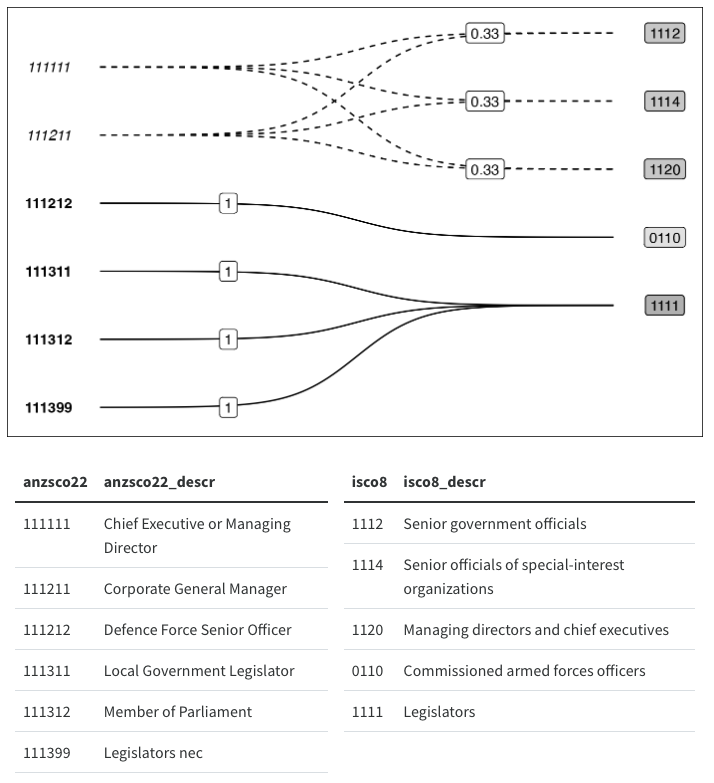

```{r setup}
library(xmap)
```

## Crossmaps

A (Nomenclature) Crossmap encodes a complete redistribution of values between a source and target classifications as a directed, bipartite, weighted graph. Numeric values transformed using a valid Crossmap will sum to the same total in both the source and target classifications. A valid Crossmap satisfies the following conditions:

1.  There is at most one link between each distinct source and target node
2.  For each source node, the sum of weights attached to all outgoing links sums to one.

For example, this mapping between occupation codes in ANZSCO22 and ISCO8 is a valid crossmap:



### Unit and Fractional Weight Links

The weights associated with each source-target link encode the transformation to be applied to values associated with a given source node. Let the weight between source node $i$ and target node $j$ be denoted $w_{ij}$. Weights can range from $[0,1]$. Note that $w_{ij} = 0$ is the trivial case where there is no link between the source and target nodes. The non-trivial cases are unit weights, $w_{ij} = 1$ and fractional weights, $w_{ij} \in (0,1)$.

Unit weights indicate that source values will be unmodified when passed into the target nomenclature. Therefore, crosswalks for recoding node labels, or collapsing multiple sub-category source nodes into parent target nodes, can both be represented as crossmaps with unit weights.

Fractional weights on the other hand indicate how a source value will be modified when passed to the target node. For example a link with a weight of $0.7$ indicates that 70% of the numeric value associated with a source node should be "passed over" to the target node.

Now, consider two links from the same source node $i$ to two different target nodes $j$ and $k$, with weights $w_{ij}$ and $w_{ik}$. Assume that the source node $i$ has no other outgoing links into the target nomenclature. Then, it follows that the weights on the two given links should sum to one if we want to preserve the total value between the source and target nomenclature. For instance, if $w_{ij} = 0.7$, then $w_{ik}$ should be $0.3$, such that 70% of the value associated with source node $i$ goes to the target node $j$, and the remaining 30% is distributed to target node $k$.

### Crossmap tables

Crossmap tables are extensions of crosswalk or lookup tables, where each row represents a weighted link between the source and target classifications. You can pass a data.frame or tibble of weighted edges to `verify_links_as_xmap()` to check if the input satisfies crossmap properties.

Your input table `x` needs to have at least 3 complete (i.e. no `NA`) columns:

-   `from`: source classification labels.
-   `to`: target classification labels
-   `weights`: applied to values in the source classification

Additional columns (e.g. for label descriptions etc.) can be retained by setting the `.drop_extra` argument to `FALSE`.

`verify_links_as_xmap` and `as_xmap_df()` will validate that:

1.  There are no duplicates `from`-`to` pairs,
2.  Every group of `weights` associated with a distinct `from` value sums to 1 (subject to a floating point tolerance).

The package also offers a experimental `xmap_df` class facilitate additional functionality such as graph property calculation and printing (i.e. relation types and crossmap direction) via a custom `print()` method, coercion to other useful classes (e.g. `xmap_to_matrix()`), visualisation (see `vignette("vis-xmaps")` for prototypes), and multi-step transformations (i.e. from nomenclature A to B to C).

Please note that the `xmap_df` class and related functions are still in active development and subject to breaking changes in future releases.

## Special Cases of Crossmaps

The conditions for valid nomenclature crossmaps defined above are sufficient to ensure that the total sum of value is retained between the source and target nomenclature However, there are a number of other transformation properties which crossmaps can also encode and validate. Such special cases include "degenerate" crossmaps. We consider a crossmap "degenerate" if it has only binary weights on all possible source-target links. In such cases the weights are implied by the presence or absence of a link.

### Types of Mapping Relations

It is helpful when thinking about special cases to define some familiar types of relations:

-   **one-to-one**: a set of links where pairs of source and target nodes are uniquely linked to each other and no other nodes. Any links in this type of relation will have unit weights.
-   **one-to-many**: a set of links where a single source node is linked to multiple target nodes. Links in this "splitting" relation will have fractional weights.
-   **one-from-many**: a set of links where a single target node is linked to multiple source nodes. This "collapse" relation is more commonly known as a **many-to-one**. Links can have either unit or fractional weights depending on whether the source nodes are part of one-to-one or one-to-many relations.
-   **many-to-many**: refers to a combination of the above relations and is often used to signal that a correspondence between sets has both **one-to-many** splitting relations and **one-from-many** collapsing relations.

Note that links in a crossmap can be partitioned into subgraphs according to the number of outgoing links (i.e. one-to-one and one-to-many)

### Recode maps

Crossmaps with only one-to-one relations recode source labels to target labels, leaving any attached values untouched. This implies that the weights on links are always 1. Notice that Schema Crosswalks, lookup tables and category recoding functions are all Recode Maps.

A common way of implementing recodings in R is named vectors or pairwise arguments such as in `forcats::fct_recode()`. Named vectors are a convenient way to store and use one-to-one and many-to-one mappings. In general it is not necessary to convert such mappings into crossmaps unless you want to combine them with fractional weight links. However, when necessary, named vectors can be converted into `xmap` by first transforming vector into two-column table of node pairs, and then attaching the implied unit weights.

``` r
# example using the named vector included in `mock` objects:
mock$recode_vect

recode_xmap <-
  xmap::as_pairs_from_named(mock$recode_vect, names_to = "iso3", values = "ctr_name") |>
  xmap::add_weights_unit(weights_into = "w") |>
  xmap::as_xmap_df(from = iso3, to = ctr_name, weights = w)
```

For a crossmap to be a recode map it must have binary weights, and the cardinality of the source and target node sets must be equal. In other words, weights can only be 0 (i.e. no link) or 1, and the number of unique source and target labels should be the same. The function `verify_named_all_1to1()` or its alias `verify_named_as_recode_unique()` uses the cardinality condition to verify whether or not a named vector has only one-to-one relation:

```{r}
fruit_color <- c(apple = "green", strawberry = "red", banana = "yellow")
fruit_color |>
  verify_named_all_1to1() |>
  print()
```

We can also identify mistakes such as accidentally assigning a value twice:

```{r error=TRUE}
fruit_color_mistake <- c(fruit_color, pear = "green")

fruit_color_mistake |>
  verify_named_as_recode_unique()
```

### Collapse or Aggregation maps

Collapse crossmaps are similar to Recode crossmaps in that source values are unmodified when passed into the target nomenclature. However, as the name suggests, multiple source nodes can be "collapsed" into the same target node, such that at least some of the source values will be aggregated in the target nomenclature. Similar to a Recode crossmap, a Collapse crossmap must only have unit weights, but the cardinality of the source node set will be larger than the target node set. This means that at least two source nodes must be linked to the same target node since there are fewer target nodes than source nodes.

Similar to the recode maps, collapse maps only have unit weights. Hence, we can use named lists to store such mappings. Consider an example such as assigning students to groups. Assume no two students share the same name:

```{r}
student_groups <- list(GRP1 = c("kate", "jane", "peter"),
                       GRP2 = c("terry", "ben", "grace"),
                       GRP3 = c("cindy", "lucy", "alex" ))
```

We can check that students are not assigned to multiple groups:

```{r}
student_groups |>
  verify_named_all_values_unique()
```

Or that the every student has been assigned a group:

```{r error=TRUE}
## mistakenly assign kate to another group
student_group_mistake <- list(GRP1 = c("kate", "jane", "peter"),
                           GRP2 = c("terry", "ben", "grace"),
                           GRP2 = c("cindy", "lucy", "kate" ))

student_list <- c("kate", "jane", "peter", "terry", "ben", "grace", "cindy", "lucy", "alex")

student_group_mistake |>
  verify_named_matchset_values_exact(student_list)
```

and each group has a unique name:

```{r error=TRUE}
student_group_mistake |>
  verify_named_all_names_unique()
```

Coercion to `xmap` requires adding weights and is directional. We can choose to verify conditions and return the same object via `verify_links_*` functions, or coerce to an `xmap` for use with other functions in the package.

```{r error=TRUE}
group_links <- student_groups |>
  as_pairs_from_named(names_to = "group", values_to = "student") |>
  add_weights_unit()

## collapse xmap from students to groups
group_links |>
  verify_links_as_xmap(from = student, to = group, weights = weights)

## reverse doesn't work without adjusting the weights
group_links |>
  verify_links_as_xmap(from = group, to = student, weights = weights)
```

Aggregation transformations can implemented as Collapse maps. Additionally, aggregation size requirements can be implemented as conditions on the number of incoming links for each target node. For instance, if you know that each target node should aggregate values from at least two source nodes, then the minimum number of non-zero incoming links should be 2 for every target node. Notice that this requirement precludes one-to-one links since it prevents any source node from being recoded into an "unshared" node in the target nomenclature.

### Split or Redistribution maps (with Equal Weights)

Any crossmap with at least one set of fractional weight (one-to-many) links involve some redistribution of source value. However, a useful special case of maps with fractional weights are split maps, which encode the disaggregation of source values into a target nomenclature. Such maps which will have mostly one-to-many relations, and do not contain one-from-many relations. This can be ensured by restricting each target node to only have one incoming link. Furthermore, we can preclude one-to-one links with the condition that all links must have fractional weights.

Notice that the same set of node pairs can generate either a split or collapse map depending on the weights added. For example, recall that in the student group example from above, swapping the `to` and `from` variables no longer formed a valid crossmap. Now consider allocating some budget of prizes equally between students in each group. This requires adding fractional weights to `group_links`, which can then be verified as a crossmap.

```{r}
group_prize_links <- student_groups |>
  as_pairs_from_named("group", "student") |>
  dplyr::group_by(group) |>
  dplyr::mutate(prize_share = 1 / dplyr::n_distinct(student))

group_prize_links |>
  verify_links_as_xmap(from = group, to = student, weights = prize_share)
```

Note that if the first crossmap condition is met, i.e. there is only one link between each unique source-node pair, then `dplyr::n()` and `dplyr::n_distinct()` are interchangeable when generating equal share weights.

## Creating `xmap_df` from Pairs and Links

The following examples demonstrate how to coerce various inputs into the experimental `xmap_df` class.

### Row-wise Links

The following example shows how to create a mixed crossmap which encodes one-to-one, many-to-one and one-to-many relations and coerce them into a `xmap_df`. This method is most suitable for simple crossmaps.

```{r}
simple_links <- tibble::tribble(
  ~source, ~target, ~share,
  "equal", "EQUAL", 1,       # one-to-one
  "member_1", "GROUP", 1,    # one-FROM-many
  "member_2", "GROUP", 1,
  "whole", "PART_1", 0.3,    # one-to-many
  "whole", "PART_2", 0.6,
  "whole", "PART_3", 0.1
)

simple_xmap <- simple_links |>
  as_xmap_df(from = source, to = target, weights = share)

simple_xmap
```

### Crosswalk/Lookup Tables

It is more common that you will want to convert an existing correspondence into a crossmap. Such conversions require attaching appropriate weights to the existing crosswalk table.

#### Recode Pairs

Consider the first five country codes in the ISO 3166 international standard and the one-to-one correspondence between the 2-digit, 2-digit and numeric codes.

```{r}
iso_codes <- tibble::tribble(
              ~country, ~ISO2, ~ISO3, ~ISONumeric,
         "Afghanistan",          "AF",         "AFG",    "004",
             "Albania",          "AL",         "ALB",    "008",
             "Algeria",          "DZ",         "DZA",    "012",
      "American Samoa",          "AS",         "ASM",    "016",
             "Andorra",          "AD",         "AND",    "020"
      )
```

We can verify any pairwise combination of columns as one-to-one recode maps using the `verify_pairs_*` functions:

```{r}
iso_codes |>
  verify_pairs_as_recode_unique(from = country, to = ISO2) |>
  print()
```

To create a crossmap between `ISONumeric` and `ISO2`, we simply add a weights columns and coerce to `xmap_df`:

```{r}
iso_xmap <- iso_codes |>
  add_weights_unit(weights_into = "weight") |>
  as_xmap_df(from = ISONumeric, to = ISO2, weights = weight)
```

Notice that `as_xmap_df()` always place the `from`, `to` and `weights` columns in order and drops any additional columns passed to it.

```{r}
print(iso_xmap)
```

To convert the validated xmap into a named vector:

```{r}
iso_xmap |>
  xmap_to_named_vector()
```

We can also easily generate validated crossmaps for the other nomenclature in the table, and keep additional columns:

```{r}
iso_codes |>
  add_weights_unit(weights_into = "weight") |>
  as_xmap_df(from = ISO2, to = ISO3, weights = weight, .drop_extra = FALSE)
```

#### Nested Lists

Now consider aggregating data which were collected using the ISO 3166-2 Subdivisions of [Australia](https://en.wikipedia.org/w/index.php?title=ISO_3166-2:AU&oldid=1110907059) and [Canada](https://en.wikipedia.org/w/index.php?title=ISO_3166-2:CA&oldid=1110906706):

```{r}
adm1_list <- tibble::tribble(
  ~ctr, ~adm1,
  "AU", "AU-NSW, AU-QLD, AU-SA, AU-TAS, AU-VIC, AU-WA, AU-ACT, AU-NT",
  "CA", "CA-AB, CA-BC, CA-MB, CA-NB, CA-NL, CA-NS, CA-ON, CA-PE, CA-QC, CA-SK, CA-NT, CA-NU, CA-YT"
)
```

Recall that we need one row per relation between the source (`adm1`) and target (`ctr`) nomenclature. Thus we split the string list into a vector, and then unnest the values by country.

```{r}
agg_x <- adm1_list |> 
  dplyr::mutate(adm1 = stringr::str_split(adm1, ", ")) |>
  tidyr::unnest(cols = c(adm1))

agg_x
```

Since aggregation involves the one-to-one transfer of values between `adm1` and `ctr` prior to the collapsing the `ctr` groups, we simple add unit weights to form a valid crossmap:

```{r}
agg_xmap <- agg_x |>
  add_weights_unit(weights_into = "link") |>
  as_xmap_df(from = adm1, to = ctr, weights = link)

agg_xmap
```

#### References for Custom Weights

Conversely, we might have aggregate level data which want to disaggregate. Continuing the above example, this could involve incorporating country level data into analysis at the 3166-2 Subdivisions level.

For example, imagine that we have population figures for Australia at the 3166-2 level for 9 out of 10 years, but only country level figures for the missing year. In this simple example, a reasonable harmonisation design could involve splitting the country level figure by the subdivision level population proportions from the year preceding or following the missing year.

Alternatively, we might want to compare aggregate and disaggregate statistics to identify discrepancies.

Using Australian population statistics from 30 Jun 2022[^1]

[^1]: Source: [Australian Bureau of Statistics](https://www.abs.gov.au/statistics/people/population/national-state-and-territory-population/jun-2022)

```{r}
state_data <- tibble::tribble(
                              ~state,    ~adm1,    ~Pop,
                   "New South Wales", "AU-NSW", 8153600,
                          "Victoria", "AU-VIC", 6613700,
                        "Queensland", "AU-QLD", 5322100,
                   "South Australia",  "AU-SA", 1820500,
                 "Western Australia",  "AU-WA", 2785300,
                          "Tasmania", "AU-TAS",  571500,
                "Northern Territory",  "AU-NT",  250600,
      "Australian Capital Territory", "AU-ACT",  456700
)

state_xmap <- state_data |>
  dplyr::mutate(ctr = "AU",
                adm1,
                share = Pop / sum(Pop)) |>
  as_xmap_df(from = ctr, to = adm1, weights = share)

state_xmap
```

### Piecewise Construction

Now consider the following mixed transformation using selected correspondences between NAICS Canada 1997 and ISIC Revision 3. Imagine that we have some numeric data (e.g. gross output in CAD) collected in the NAICS Canada nomenclature that we want to harmonise into ISIC Revision 3. The correspondence between the two nomenclature contains a mixture of one-to-one, one-to-many, and one-from-many relations.

Luckily, we can split the source nomenclature into two groups:

1.  source nodes with only one outgoing link (one-to-one relations with unit weights)
2.  source nodes with multiple outgoing links (one-to-many relations with fractional weights)

Let's first define somed example correspondences.[^2]

[^2]: based on examples provided by Statistics Canada on the page [How to Read a Concordance Table](https://www.statcan.gc.ca/en/subjects/standard/concordances/concordanc_tabl3).

In the first example, one NAICS Canada class relates to exactly one ISIC class, forming a one-to-one relation.

```{r}
canada_recode <- tibble::tibble(
  NAICS1997      = "212210", 
  NAICS1997_desc = "Iron Ore Mining",
  ISIC3          = "C1310",
  ISIC3_desc    = "Mining of iron ores"
)
```

```{r echo=FALSE}
knitr::kable(canada_recode)
```

In the second example, the ISIC target class `D1543` is equivalent to more than one NAICS Canada source class, forming a one-from-many relation. The asterisk (Partial Flag) indicates that part of ISIC D1543 is equivalent to each NAICS Canada class. The ISIC activities corresponding to each NAICS Canada class are listed in the column labelled "Link".

```{r}
canada_agg <- tibble::tribble(
  ~NAICS1997, ~NAICS1997_desc, ~ISIC3, ~ISIC3_desc, ~Link,
  "311320", "Chocolate and Confectionery Manufacturing from Cacao Beans", "D1543 *", "Manufacture of cocoa, chocolate and sugar confectionery", "Chocolate and confectionery, made from cacao beans",
  "311330", "Confectionery Manufacturing from Purchased Chocolate", "D1543 *", "Manufacture of cocoa, chocolate and sugar confectionery", "Confectionery, made from purchased chocolate",
  "311340", "Non-Chocolate Confectionery Manufacturing", "D1543 *", "Manufacture of cocoa, chocolate and sugar confectionery", "Non-chocolate confectionery, manufacturing"
)
```

```{r echo=FALSE}
knitr::kable(canada_agg)
```

Notice that for both one-to-one and one-from-many relations, values attached to each source category are not directly modified during the "transfer" between source and target nomenclature. Instead, the source values are either retained, or summarised when the category collapse (and value aggregation) is performed. Thus, as shown above, all links in the above examples will take unit weights.

In this third example, one souce NAICS Canada class is equivalent to more than one target ISIC class, forming a one-to-many relation.

```{r}
canada_split <- tibble::tribble(
  ~NAICS1997, ~NAICS1997_desc, ~ISIC3, ~ISIC3_desc, ~Link,
  "483213", "Inland Water Transportation (except by Ferries)", "I6110 *", "Sea and coastal water transport", "Intracoastal water transportation",
  "483213", "Inland Water Transportation (except by Ferries)", "I6120 *", "Inland water transport", "Inland water transportation (except ferries)"
)
```

```{r echo=FALSE}
knitr::kable(canada_split)
```

Let's clean up the recode and collapse relations shown above:

```{r}
canada_unit <- canada_agg |>
  # remove the partial flag (*)
  dplyr::mutate(ISIC3 = stringr::str_remove(ISIC3, " \\*")) |>
  dplyr::select(-Link) |>
  # bind the links together and add weights
  dplyr::bind_rows(canada_recode) |>
  dplyr::mutate(share = 1)
```

```{r echo=FALSE}
knitr::kable(canada_unit)
```

Now all that remains is to prepare the split links. Similar to the disaggregation example above, we need to design weights to allocate the "pool" of numeric value associated with the NAICS class `483213` into the corresponding ISIC classes `I6110` and `I6120`.

Assume for illustration purposes that we have reference data to suggest the Canadian "Inland water transport" industry (`I6120`) is twice as big as the "Sea and coastal water transport" industry (`I6110`). This suggests that the weight between `483213` and `I6120` should be twice that of `I6110`.

```{r}
canada_frac <- canada_split |>
  dplyr::mutate(ISIC3 = stringr::str_remove(ISIC3, " \\*")) |>
  dplyr::select(-Link) |>
  dplyr::mutate(share = dplyr::case_when(ISIC3 == "I6110" ~ 0.33,
                                  ISIC3 == "I6120" ~ 0.67,
                                  T ~ NA_real_))
```

Now let's combine the unit and fractional links into a crossmap:

```{r}
canada_xmap <- dplyr::bind_rows(canada_unit, canada_frac) |>
  as_xmap_df(from = NAICS1997, to = ISIC3, weights = share)

print(canada_xmap)
```

## Reversing Crossmaps

### One-Way Maps

Except in the case of recoding, crossmaps are generally lateral (one-way). Weights on collapse and split links are no longer valid if you reverse the direct of the link. Notice that `as_xmap_df()` throws an error if you try to naively swap the `from` and `to` arguments:

```{r error=TRUE}
dplyr::bind_rows(canada_unit, canada_frac) |>
  as_xmap_df(from = ISIC3, to = NAICS1997, weights = share)
```

### Reversible Maps

However, we **can** swap the arguments on a recode map. Recall the ISO country code crossmap we created above:

```{r}
print(iso_xmap)
```

Imagine that instead of converting country codes from ISO Numeric to ISO-2 digit, we wanted to convert from ISO-2 digit to ISO Numeric. We can take the existing crossmap and invert it without editing any weights:

```{r}
iso_xmap |>
  xmap_reverse()
```

A less trivial reversal is creating an aggregation map from a disaggregation map. Recall the country to state level disaggregation map we created above:

```{r}
state_xmap |>
  xmap_drop_extra()
```

Now imagine we wanted to re-aggregate the data, say after some state-level adjustments:

```{r}
state_xmap |>
  xmap_reverse(weights_into = "agg_w") |>
  xmap_drop_extra()
```
